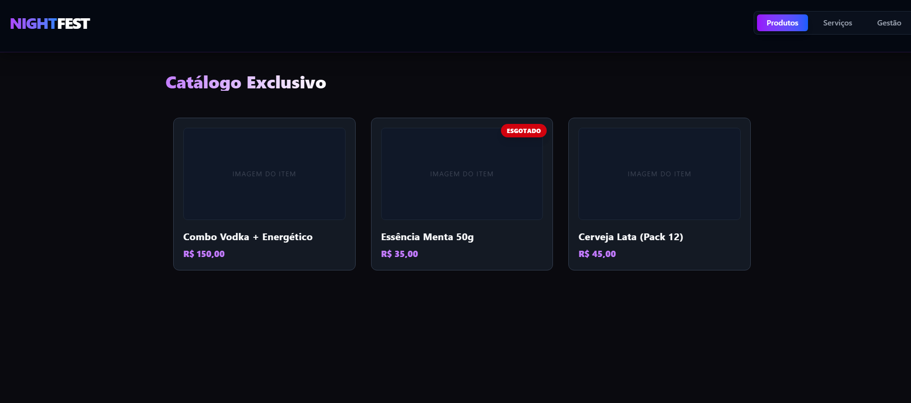
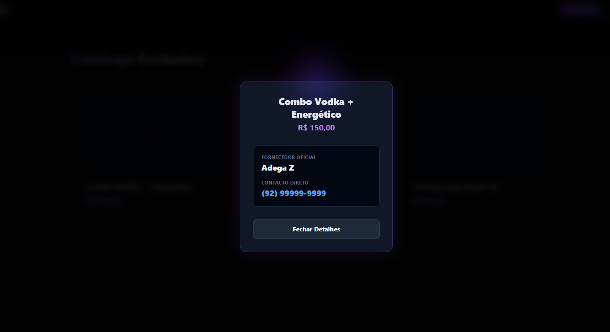
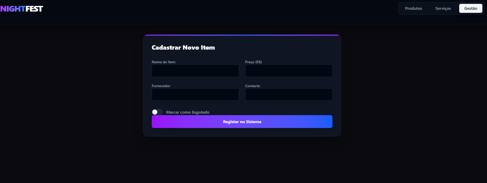

# NightFest - Sistema Web Comercial 

Desenvolvimento de um sistema web comercial para divulgação, conexão e venda de produtos e serviços dedicados a festas noturnas. O projeto visa conectar fornecedores (bebidas, essências, DJs, bartenders) a clientes interessados em organizar eventos, oferecendo um catálogo dinâmico e um painel de gestão.

## Funcionalidades Atuais (Front-end)

* **Design Moderno:** Interface com temática "Nightclub" (Dark Mode), utilizando efeitos de neon, desfoque (backdrop-blur) e transições suaves.
* **Navegação em Abas:** Separação clara entre o catálogo de 'Produtos', a lista de 'Serviços' e a área de 'Gestão'.
* **Filtros Dinâmicos:** Sistema de categorização para facilitar a busca (ex: filtrar apenas "Bebidas", "Essências" ou "Música").
* **Modais Interativos:** Visualização detalhada dos itens com informações de contato direto do fornecedor oficial.
* **Simulação de Autenticação:** Tela de Login e Cadastro para proteger o painel de administração.
* **Painel de Gestão (CRUD Mock):** Interface preparada para o cadastro de novos produtos/serviços, definição de categorias e controle de estoque (marcar como esgotado).

## Tecnologias Utilizadas

* **React.js:** Biblioteca principal para a construção da interface e gerenciamento de estados (`useState`).
* **Vite:** Ferramenta de build super rápida para o ambiente de desenvolvimento.
* **Tailwind CSS (v4):** Framework de CSS utilitário utilizado para toda a estilização, responsividade e efeitos visuais diretos no JSX.
* **JavaScript (ES6+):** Lógica de filtros, manipulação de arrays e controle de interface.

## Status do Projeto

* **Fase Atual:** Front-end finalizado (Mocks e UI/UX concluídos).
* **Próxima Fase:** Desenvolvimento da API, integração com banco de dados e autenticação de usuários.

## Arquitetura e Back-end (Em breve)

Para garantir segurança e escalabilidade comercial, a próxima etapa do desenvolvimento contemplará:
* **API RESTful:** Construída com Node.js e Express.js para gerenciar rotas, fornecedores e controle de estoque.
* **Banco de Dados:** Estruturação relacional (PostgreSQL ou MySQL) garantindo a integridade e normalização (ACID) das transações e cadastros.
* **Segurança:** Autenticação e proteção de rotas privadas no painel de gestão.

## Demonstração Visual

## Contato Comercial e Licença

**Aviso Legal:** Este é um projeto comercial de código fechado (Proprietário). A cópia, distribuição ou modificação não autorizada deste código é estritamente proibida.

Para propostas comerciais, aquisição do sistema ou desenvolvimento sob medida, entre em contato:
* **Email:** santosj.jacinto@gmail.com ; montenegrokleber7@gmail.com
* **LinkedIn:** [Josué dos santos](https://linkedin.com/in/josuedossantosj)/ [Kleber Marcelo](https://linkedin.com/in/kleber-montenegro)
